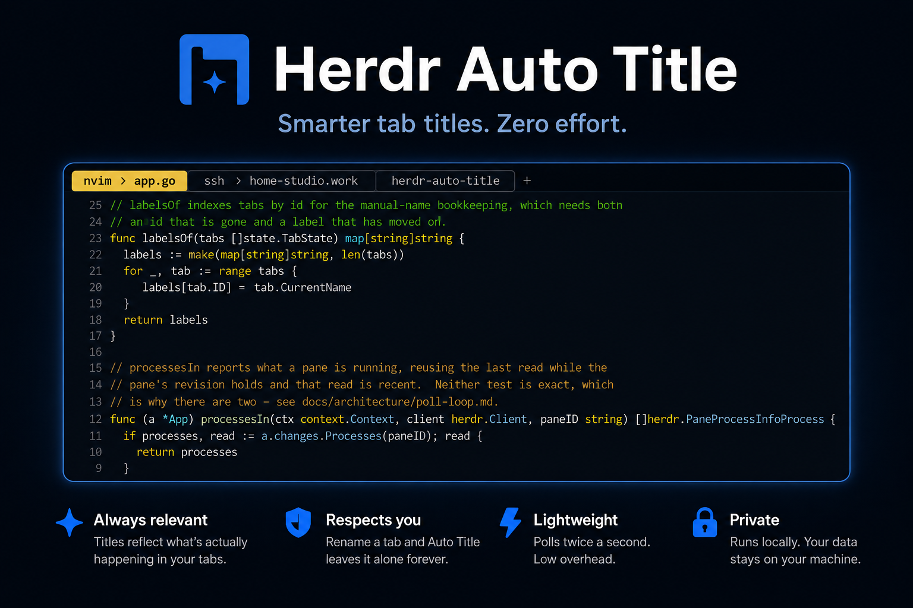

<div align="center">
  <p>
    
  </p>
  <p>
    <a href="https://github.com/kryptamine/herdr-auto-title/actions/workflows/ci.yml"></a>
    <a href="https://github.com/kryptamine/herdr-auto-title/releases"></a>
    <a href="https://go.dev"></a>
    <a href="LICENSE"></a>
  </p>
</div>

A [Herdr](https://herdr.dev) plugin that reads your session twice a second and
keeps every tab's title in step with the work in it. Rename a tab yourself and
it leaves that tab alone from then on.

## Demo

https://github.com/user-attachments/assets/94d9f4f3-b986-4664-a9bc-d078ece4f05e

## Quick start

> [!IMPORTANT]
> Requires Herdr 0.8.2+ and Go 1.24+ on macOS or Linux. Herdr compiles the
> plugin from source on your machine when it installs it.

```sh
herdr plugin install kryptamine/herdr-auto-title
```

Herdr clones the repository, builds the binary and registers it, but it starts
a plugin only when a session starts. **Restart Herdr once after installing**;
until you do, nothing is renamed. `herdr plugin list` shows it, `herdr plugin
disable` turns it off.

Working on the plugin rather than using it? [Development](docs/development.md)
covers linking a local checkout, which Herdr makes you unlink before `install`
will run.

## What your tabs will be called

```
~/work/dashboard                       →  dashboard
nvim editing auth.provider.ts          →  nvim › auth.provider.ts
an agent working on OAuth scopes       →  dashboard › claude › Implement OAuth scopes
ssh into prod-01                       →  ssh › prod-01
$HOME                                  →  Shell
```

Titles read `<context> › <activity>`, capped at 64 columns of the tab bar. The
activity is the first of these that has something to say: what an agent reports
it is working on, then the terminal title, then a lone program in the pane. The
context is the directory you are in, or the machine you reached over `ssh`.

Four rules explain most surprises:

- Auto Title never repeats your workspace name, because Herdr already shows it
  above the tabs.
- It drops paths, shell prompts and bare program names, which only say again
  where you are.
- A tab with several panes takes its name from one of them: the focused pane, a
  pane running a busy agent, or the pane that changed last.
- **A tab you renamed is yours.** Auto Title never touches it again.

> [!WARNING]
> Renaming it again does not hand it back. To get automatic naming for that tab,
> stop the plugin, delete its entry from `manual-names.json` (or delete the
> whole file), and start the plugin again.

## Documentation

- [Architecture](docs/architecture/) — how it works and why: the poll loop, how
  a tab becomes a name, and the measured facts about the Herdr socket API.
- [Development](docs/development.md) — working on it.
